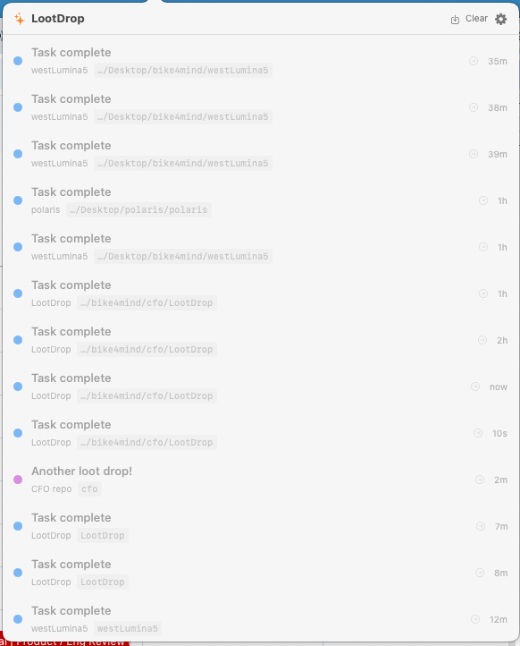
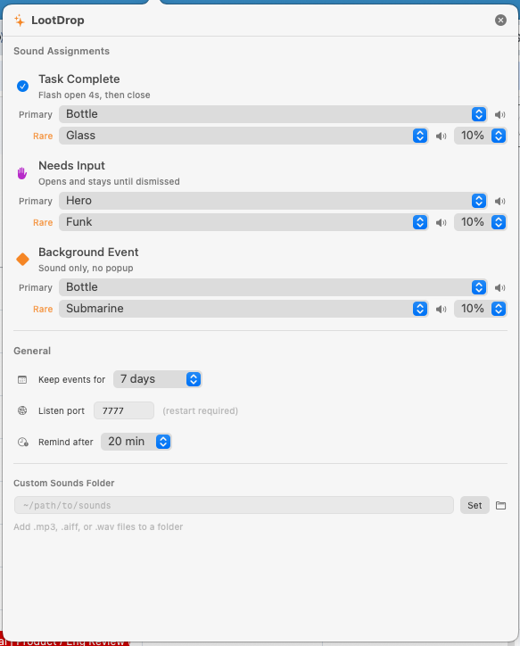

# LootDrop

A native macOS menubar app that turns your development events into loot drops.

LootDrop receives events via HTTP, plays configurable sounds (including a Diablo-inspired rare item discovery SFX), shows a notification popover, and lets you tap any event to instantly focus the source terminal window. Built for developers running multiple AI coding sessions simultaneously.

## Why LootDrop Exists

If you run multiple Claude Code (or other AI coding) sessions in parallel across different projects, you know the problem: one terminal needs your approval, another just finished a build, and a third compacted its context — but you're staring at the wrong window.

LootDrop is your loot feed. Every event gets a sound, a rarity tier, and a tap target. You hear what happened, you see the feed, you tap to jump there. No more hunting through terminal tabs.

| Event Feed | Settings |
|:---:|:---:|
|  |  |

## Features

**Three Notification Behaviors**

| Behavior | When | Sound | Popover |
|----------|------|-------|---------|
| `flash` | Task complete | Configurable | Opens 4s, auto-closes |
| `persist` | Needs your input | Configurable | Stays open until you dismiss |
| `silent` | Background event | Configurable | Sound only, badge updates |

**Sound Rarity System** — Borrowed from game design. Each behavior has a primary sound and a rare sound with a configurable chance (5%, 10%, 20%). Most of the time you hear the normal sound, but occasionally you get the rare variant. This prevents auditory fatigue — the same principle Diablo uses so you never get tired of hearing loot drops.

**Tap-to-Focus** — Every event carries a `source` field (typically your project directory name). Tap an event row and LootDrop closes the popover, finds the Ghostty terminal window whose title contains that source string, and raises it to focus. Works via macOS Accessibility API.

**Drift Detector** — Tracks approval-waiting events. If you leave a Claude Code session waiting for permission for 20 minutes (configurable), LootDrop plays a reminder sound and pops open: "Forgotten session (20m) — Still waiting for approval."

**Persistent History** — Events are saved to `~/.config/lootdrop/history.json` with configurable retention (3, 7, 14, or 30 days). When you restart LootDrop, your event feed is still there. Previous session events appear dimmed so new ones stand out.

**One-Click Export** — Hit the download icon in the header to export today's events as a markdown file grouped by project. Instant standup notes, saved to `~/Downloads/`.

**Full Sound Customization** — All 14 macOS system sounds are available in every dropdown. Point the Custom Sounds Folder at any directory with `.mp3`, `.aiff`, or `.wav` files to add your own. Each behavior has independent primary + rare sound assignment.

**Settings Page** — Click the gear icon to configure everything: sounds, rare chance percentages, retention days, listening port, drift reminder interval, and custom sounds folder.

## Installation

### Prerequisites

- macOS 13+ (Ventura or later)
- Swift 5.9+ (included with Xcode or Xcode Command Line Tools)
- [Ghostty](https://ghostty.org) terminal (for tap-to-focus — everything else works without it)

### Build and Install

```bash
git clone https://github.com/MillionOnMars/lootdrop.git
cd lootdrop
./build.sh
```

This compiles the Swift package, copies the binary into the `.app` bundle, and ad-hoc code signs it.

### Auto-Start on Login

```bash
cp com.erikbethke.lootdrop.plist ~/Library/LaunchAgents/
# Edit the plist to update the path to your LootDrop.app location
launchctl load ~/Library/LaunchAgents/com.erikbethke.lootdrop.plist
```

### Grant Accessibility Permission

For tap-to-focus to work, LootDrop needs Accessibility access:

1. Open **System Settings > Privacy & Security > Accessibility**
2. Click the **+** button
3. Navigate to `LootDrop.app` and add it
4. Toggle it on

## Usage

### Command Line

`bin/lootdrop` talks to the running app. Symlink it onto your PATH:

```bash
ln -s "$PWD/bin/lootdrop" ~/bin/lootdrop
```

```bash
lootdrop "Build finished"                        # fire an event now
lootdrop remind 20m "get up and take a walk"     # fire one later
lootdrop send "Deploy done" --rarity legendary --behavior persist
lootdrop send "Standup" --in 1h30m               # any duration: 90s, 20m, 2h, 1h30m
lootdrop dnd 45m                                 # mute for 45 minutes
lootdrop dnd on | lootdrop dnd off               # mute indefinitely / resume
lootdrop status                                  # {"dnd":false,"scheduled":2,...}
lootdrop cancel                                  # drop every pending reminder
```

**Do Not Disturb** silences sounds and popovers without silencing the record — muted
events still land in the feed and still count on the badge. The menubar icon changes to
a moon while muted, because an app that has quietly stopped notifying you looks exactly
like an app with nothing to say.

**Reminders** are persisted to `~/.config/lootdrop/scheduled.json` and restored on
launch. One you scheduled before a restart still fires; one whose time passed while the
Mac was asleep fires on the next tick after it wakes, rather than being dropped.

### Sending Events

POST JSON to `http://localhost:7777/event`:

```bash
curl -X POST http://localhost:7777/event \
  -H "Content-Type: application/json" \
  -d '{
    "type": "pr_merged",
    "title": "PR #42 merged",
    "subtitle": "bike4mind repo",
    "rarity": "legendary",
    "source": "myproject",
    "behavior": "flash"
  }'
```

**Fields:**

| Field | Required | Values |
|-------|----------|--------|
| `type` | yes | Any string (for your own categorization) |
| `title` | yes | Main event text |
| `subtitle` | no | Secondary text |
| `rarity` | no | `common`, `rare`, `epic`, `legendary` (affects dot color) |
| `source` | no | Terminal/project identifier (used for tap-to-focus) |
| `behavior` | no | `flash`, `persist`, `silent` (default: `flash`) |
| `pid` | no | Process ID (for future use) |

**Health check:**

```bash
curl http://localhost:7777/health
```

### Claude Code Integration

Add LootDrop hooks to `~/.claude/settings.json`:

```json
{
  "hooks": {
    "Notification": [
      {
        "matcher": "permission",
        "hooks": [
          {
            "type": "command",
            "command": "curl -s -X POST http://localhost:7777/event -H 'Content-Type: application/json' -d '{\"type\":\"permission\",\"title\":\"Approval needed\",\"subtitle\":\"'$(basename $PWD)'\",\"rarity\":\"epic\",\"source\":\"'$(basename $PWD)'\",\"behavior\":\"persist\"}' > /dev/null 2>&1 &"
          }
        ]
      },
      {
        "matcher": "compact",
        "hooks": [
          {
            "type": "command",
            "command": "curl -s -X POST http://localhost:7777/event -H 'Content-Type: application/json' -d '{\"type\":\"compaction\",\"title\":\"Context compacted\",\"subtitle\":\"'$(basename $PWD)'\",\"rarity\":\"legendary\",\"source\":\"'$(basename $PWD)'\",\"behavior\":\"silent\"}' > /dev/null 2>&1 &"
          }
        ]
      },
      {
        "matcher": "",
        "hooks": [
          {
            "type": "command",
            "command": "curl -s -X POST http://localhost:7777/event -H 'Content-Type: application/json' -d '{\"type\":\"done\",\"title\":\"Task complete\",\"subtitle\":\"'$(basename $PWD)'\",\"rarity\":\"rare\",\"source\":\"'$(basename $PWD)'\",\"behavior\":\"flash\"}' > /dev/null 2>&1 &"
          }
        ]
      }
    ]
  }
}
```

### Git Hook Integration

Add to `.git/hooks/post-merge`:

```bash
#!/bin/bash
curl -s -X POST http://localhost:7777/event \
  -H "Content-Type: application/json" \
  -d "{\"type\":\"merge\",\"title\":\"Branch merged\",\"subtitle\":\"$(git log -1 --pretty=%s)\",\"rarity\":\"epic\",\"source\":\"$(basename $PWD)\",\"behavior\":\"flash\"}" \
  > /dev/null 2>&1 &
```

### Other Integration Ideas

- **CI/CD notifications** — Pipe deploy success/failure events from Vercel, AWS, or GitHub Actions
- **Payment webhooks** — Relay Stripe or bank notifications through a local proxy
- **Cron jobs** — Fire events when scheduled tasks complete
- **Uptime monitors** — Route alerts from Uptime Robot or Pingdom

## Architecture

~600 lines of Swift. Zero external dependencies. Builds with `swift build`.

```
Sources/LootDrop/
  main.swift           — App delegate, NSStatusItem, popover, drift detector
  EventModel.swift     — LootEvent, IncomingEvent, Rarity, EventBehavior
  EventStore.swift     — Persistent event storage, markdown export
  EventServer.swift    — HTTP server on NWListener (Network.framework)
  SoundPlayer.swift    — AVFoundation audio, dynamic sound discovery
  Settings.swift       — Codable settings, BehaviorSoundConfig with rarity rolls
  DriftDetector.swift  — Timer-based reminder for forgotten approval requests
  ContentView.swift    — SwiftUI popover UI, settings page, event feed
  WindowFocuser.swift  — AppleScript-based Ghostty window focusing
```

**Key design decisions:**
- **NWListener** for HTTP instead of a dependency like Swifter or SwiftNIO — two endpoints don't need a framework
- **NSPopover with `.applicationDefined` behavior** — lets clicks inside the popover register (`.transient` steals them)
- **Global event monitor** for click-outside-to-dismiss — replaces the popover's built-in behavior
- **Ad-hoc code signing** — removes "unidentified developer" warnings without requiring an Apple Developer account

## Configuration

All settings stored in `~/.config/lootdrop/settings.json`. Event history in `~/.config/lootdrop/history.json`. Both are created automatically on first run.

## Game Design Principles

LootDrop borrows three ideas from game design:

1. **Variable ratio reinforcement** — The sound rarity system means you never know when you'll hear the rare sound. This is the same psychological principle behind slot machines and Diablo's loot system. It keeps the notification sounds feeling fresh instead of becoming background noise.

2. **Sensory differentiation** — Different sounds for different behaviors means you learn to recognize event types by ear. You know it's a permission request before you look. This is how fighting games use distinct hit sounds for light vs. heavy attacks.

3. **Rarity coloring** — Common (gray), rare (blue), epic (purple), legendary (orange). The same tier system from World of Warcraft. It makes the event feed scannable at a glance and adds weight to important events.

## Origin Story

LootDrop started as a hunt for a sound effect. The Diablo ring discovery SFX had been used in Million on Mars (as `OreDiscovery.mp3`) for finding valuable ore veins. The sound was too good to lose, so it got copied into a new project. Then the question was: "What events could trigger this sound?" That led to a macOS menubar app, which led to Claude Code hooks, which led to a full notification system with game design principles. The whole thing was built in a single afternoon with Claude Code.

## License

MIT License. See [LICENSE](LICENSE) for details.

## Contributing

Issues and PRs welcome. This is a personal tool that turned out to be useful — if you have ideas, open an issue.
